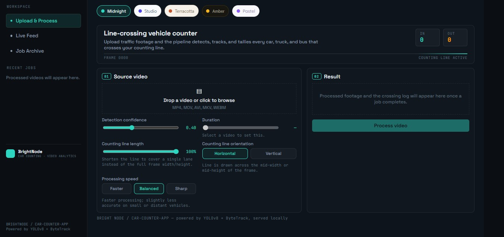
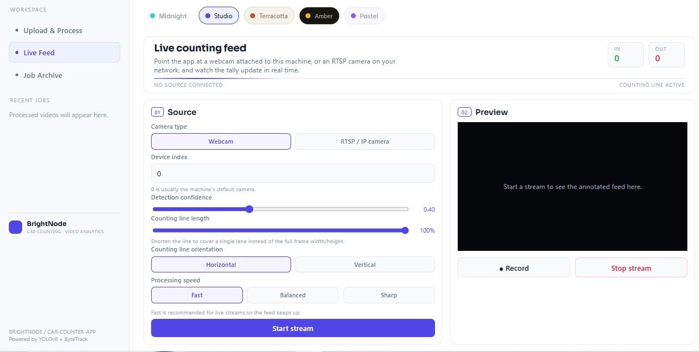
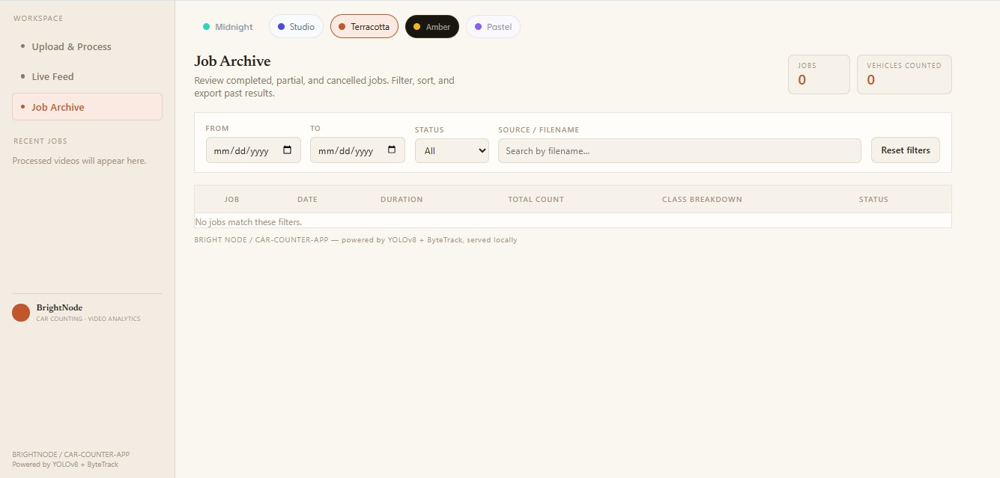

# Car Counter

**BrightNode — Line-crossing vehicle detection, tracking, and counting, served as a local FastAPI web app.**

Car Counter wraps a YOLOv8 + ByteTrack detection/tracking pipeline in a browser UI. Point it at an uploaded video or a live camera/RTSP feed, draw a counting line, and get real-time IN/OUT tallies for cars, trucks, buses, and motorcycles — no cloud services, no external database, everything runs locally.

| Upload & Process | Live Feed | Job Archive |
|---|---|---|
|  |  |  |

The UI ships with five selectable themes (Midnight, Studio, Terracotta, Amber, Pastel) shown above.

## Features

- **Upload & Process** — upload a video (MP4/MOV/AVI/MKV/WEBM), it's processed frame-by-frame in the background, and you get an annotated output video plus a CSV crossing log, with live progress polling in the browser.
- **Live Feed** — run against a webcam attached to the server (by device index) or an RTSP/IP camera URL. Each session streams an annotated MJPEG preview with a running IN/OUT tally, and recording to disk can be toggled on the fly.
- **Configurable detection** — adjust detection confidence, counting-line position/orientation (horizontal or vertical), and processing speed/accuracy trade-off per job.
- **Class-filtered counting** — only counts COCO vehicle classes (car, truck, bus, motorcycle) via a `supervision` `LineZone`, so pedestrians and other objects don't skew the tally.
- **Automatic codec fallback** — output writer tries `avc1` → `H264` → `mp4v`, and transcodes to H.264 with `ffmpeg` (if available) for guaranteed in-browser playback.
- **No build step frontend** — a vanilla HTML/CSS/JS UI polls the API and renders MJPEG streams directly; no framework, no bundler.

## How it works

Two workflows share one inference core:

1. **Upload & Process** (`app/jobs.py`) — `POST /api/jobs` accepts a video, then a background thread runs it through the pipeline, producing an annotated MP4 and a CSV crossing log in `outputs/`.
2. **Live Feed** (`app/live.py`) — a webcam (by device index) or RTSP URL is opened server-side with OpenCV. Each session gets its own capture/inference thread and can toggle recording to disk.

Shared core:

- `app/pipeline.py` — `CarCounterPipeline`, the headless detection/tracking/counting engine. One stateful instance per job/session. YOLO models are cached process-wide, and an OpenVINO export is auto-preferred over raw PyTorch weights when present.
- `app/main.py` — all FastAPI routes.
- `app/schemas.py` — Pydantic request/response models.
- `static/` — the frontend: `fetch`-polling for job/session state, MJPEG (`multipart/x-mixed-replace`) for live video previews.

All state is in-memory (no database) — `job_manager` and `live_manager` hold everything in module-level dicts, so output files in `outputs/` are what survive a server restart.

## Getting started

Dependencies are managed with [uv](https://docs.astral.sh/uv/):

```bash
uv sync
```

This creates a repo-local `.venv/` from `pyproject.toml` / `uv.lock` (Python 3.12, CPU-only PyTorch from the pytorch.org index). The first run downloads `yolov8n.pt` (COCO weights) automatically via `ultralytics`.

Run the app:

```bash
uv run uvicorn app.main:app --reload --port 8000
```

Then open **http://localhost:8000**.

### Environment variables

| Variable | Purpose | Default |
|---|---|---|
| `CAR_COUNTER_WEIGHTS` | Path to alternate YOLO `.pt` weights | `yolov8n.pt` |
| `CAR_COUNTER_LOGO` | Path to the watermark logo image | `app/BrightNodeLogo.jpg` |

Both the upload pipeline and live sessions read these at process start.

## Project layout

```
CarCounterFASTAPI/
├── app/
│   ├── main.py         FastAPI routes (upload jobs + live sessions)
│   ├── pipeline.py     Detection/tracking/counting/HUD/watermark core
│   ├── jobs.py         Background job manager for uploaded videos
│   ├── live.py         Live session manager (webcam/RTSP, MJPEG streaming)
│   └── schemas.py      Pydantic response/request models
├── static/             Vanilla HTML/CSS/JS frontend
├── design/             Static HTML dashboard mockups (reference only)
├── screenshots/        README screenshots
├── uploads/            Uploaded source videos (created at runtime)
├── outputs/            Annotated videos, CSV logs, recordings (created at runtime)
├── Dockerfile
├── pyproject.toml      Dependencies (managed with uv)
└── uv.lock
```

## API reference

| Method | Path | Purpose |
|---|---|---|
| `POST` | `/api/jobs` | Upload video (`file`, `conf`, `line_axis`) |
| `GET` | `/api/jobs` | List recent jobs |
| `GET` | `/api/jobs/{id}` | Job status / progress |
| `GET` | `/api/jobs/{id}/video` | Annotated output video |
| `GET` | `/api/jobs/{id}/csv` | Crossing log CSV |
| `POST` | `/api/live/start` | Start live session (`source_type`, `source_value`, `conf`, `line_axis`) |
| `GET` | `/api/live/{id}/status` | Live counts / status |
| `GET` | `/api/live/{id}/feed` | MJPEG annotated stream |
| `POST` | `/api/live/{id}/record` | Toggle recording to disk |
| `POST` | `/api/live/{id}/stop` | Stop the session |

## Notes

- **Custom weights** — to use a fine-tuned model instead of stock `yolov8n.pt`, set `CAR_COUNTER_WEIGHTS` before launching.
- **Webcam in Live Feed** opens a camera attached to the machine running `uvicorn`, not the viewer's browser camera.
- **RTSP** sources are opened the same way OpenCV opens them from the command line.
- **Browser playback** — if `ffmpeg` isn't on `PATH`, the raw `mp4v` output still downloads fine but may not preview inline in some browsers. Installing `ffmpeg` (e.g. https://www.gyan.dev/ffmpeg/builds/) enables automatic H.264 transcoding.
- **Docker** — a `Dockerfile` is included; RTSP-onl